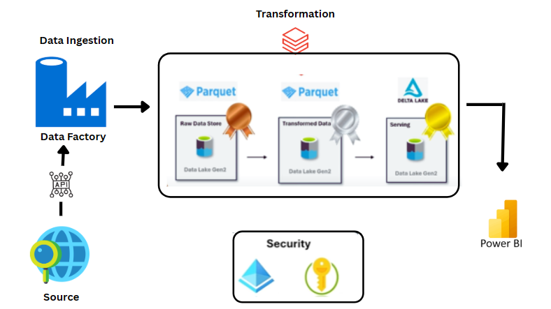

# NYC-TAXI Analytics | Modern DE Project

## **Introduction**
This modern data engineering project leverages the power of Azure to analyze NYC taxi trip data. We built an end-to-end pipeline, ingesting data via HTTP API, Dynamicaly pulling the data to Azure Data Factory and orchestrating transformations with Databricks, and storing insights in Azure Data Lake for analysis.

## **Architecture**
In this project **Medallion Architecture** is used

## Technologies Used
1. Progarmming language - Python
2. Scripting Language - SQL
3. Azure Cloud Platform
     - Data Factory
     - Databricks
     - PowerBI

## **Dataset Used**
   **NYC Taxi Trip Data - Green Line**
This repository contains the code and documentation for a data engineering project focused on analyzing the **Green Taxi Trip Records** from the New York City Taxi and Limousine Commission (TLC). This dataset provides detailed information about individual taxi trips, including pickup and dropoff times and locations, passenger count, trip distance, fare amounts, payment types, and more, specifically for green taxis.The data was accessed via **public HTTP API provided by the TLC or a downloaded dataset from their website**.

Original Dataset - https://d37ci6vzurychx.cloudfront.net/trip-data/green_tripdata_2023-01.parquet

## **Scripts for Project**
1. Bronze
2. Silver
3. Gold

